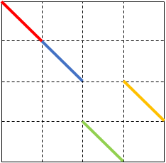
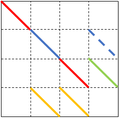

# KGBench

KGBench is a toolbox for knowledge representation learning, which is featured with various automated machine learning methods (e.g. `AutoBLM` in TPAMI-2022, `KGTuner` in ACL-2022 and the HPO toolbox `Ax`). The AutoML techniques enable model and hyperparameter search to improve the performance on the representative KG learning task link prediciton.

This repo is developed upon [LibKGE](https://github.com/uma-pi1/kge), which is highly configurable, easy to use, and extensible. Compared to the previous code, we have added [AutoBLM](https://ieeexplore.ieee.org/document/9729658) which adopts bilevel optimization to search bilinear scoring functions, [KGTuner](https://aclanthology.org/2022.acl-long.194.pdf) which has a two-stage hyperparameter search algorithm. In addition, it can add [Relation Prediction](https://openreview.net/pdf?id=Qa3uS3H7-Le) as an auxiliary training objective and [Node Piece](https://arxiv.org/abs/2106.12144) as a special embedder.

KGBench works on both the commonly used KG datasets [WN18RR](https://github.com/TimDettmers/ConvE/blob/master/WN18RR.tar.gz) and [FB15k-237](https://www.microsoft.com/en-us/download/details.aspx?id=52312), as well as the large-scale datasets in OGB, i.e., [ogbl-biokg](https://ogb.stanford.edu/docs/linkprop/#ogbl-biokg) and [ogbl-wikikg2](https://ogb.stanford.edu/docs/linkprop/#ogbl-wikikg2). The current best performance achieved by this toolbox is listed below. Better results may be obtained with more searching trials.

| Dataset      | #Dim | #Parameters | Model Structure                                              | Test MRR       | Valid MRR      | Configuration                                          | Hardware         | Mem     |
| ------------ | ---- | ----------- | ------------------------------------------------------------ | -------------- | -------------- | ------------------------------------------------------ | ---------------- | ------- |
| ogbl-biokg   | 2048 | 192,047,104 |  | 0.8536 ±0.0003 | 0.8548 ±0.0002 | [biokg_best.yaml](example/biokg/biokg_best.yaml)       | Tesla A100 (80G) | 7687MB  |
| ogbl-wikikg2 | 256  | 640,154,624 |  | 0.6404         | 0.6735         | [wikikg2_best.yaml](example/wikikg2/wikikg2_best.yaml) | Tesla A100 (80G) | 41307MB |


| Dataset   | MRR    | Hits@1 | Hits@10 | Model Structure | Configuration                                                |
| --------- | ------ | ------ | ------- | --------------- | ------------------------------------------------------------ |
| FB15k-237 | 0.3668 | 0.2764 | 0.5493  | ComplEX         | [FB15k-237_best.yaml](example/FB15k-237/FB15k-237_best.yaml) |
| WN18RR    | 0.4885 | 0.4489 | 0.5592  | ComplEX         | [WN18RR_best.yaml](example/WN18RR/WN18RR_best.yaml)          |


Exampler configurations are provided in the [example](example) folder. The following is the instruction for AutoBLM and KGTuner as well as the usage of auxiliary techniques Relation Prediction and Node Piece. See the LibKGE's [README](https://github.com/uma-pi1/kge/blob/master/README.md) for more details of how to use this toolbox and the [Instruction](kgbench/job/Instruction.md) for how to use AutoBLM, KGTuner, Relation Prediction and Node Piece. 


## Quick Start 

Here, we provide quick start on how to reproduce the results on the datasets in OGB.

```bash
# retrieve and install project in development mode
git clone https://github.com/AutoML-Research/KGBench
cd KGBench
pip install -e .

# reproduce our best results on biokg using kgbench start directly
kgbench start example/biokg/biokg_best.yaml

# search blm model structure on biokg
kgbench start example/biokg/biokg_blm_search.yaml

# search hyperparameters
kgbench start example/biokg/biokg_ax_search.yaml

# evaluate on test data after training, using kgbench test + the folder where your training results saved, for example, 
kgbench test local/experiments/yyyymmdd-hhmmss-config_file_name
```

If you start training on biokg or wikikg2 for the first time, it will take a few minutes for their preprocessing. There are more examples in the folder [biokg](example/biokg) and [wikikg2](example/wikikg2), where we provide the configuration to the search or reproduce the best results. You can use these examples to get into our pipeline quickly. 

Since the OGB link prediction datasets have their unique evaluate way, we only provide two models, i.e. AutoBLM and ComplEX, to do evaluation. You can overwrite the two functions, i.e. `score_emb_sp_given_negs` and `score_emb_po_given_negs`, to adapt other models.


## Thanks

This toolbox was developed by Lin Li (lli18@mails.tsinghua.edu.cn) as undergraduate graduation project. Due to the limit of time and my competence, there may be some mistakes in the toolbox. Please inform us if you find some bugs or have some advice for our code. Your suggestions are welcomed. 

Thanks for Professor Quanming Yao (qyaoaa@mail.tsinghua.edu.cn) and Doctor Yongqi Zhang (zhangyongqi@4paradigm.com) for their advice and support during the development of this toolbox. Thanks for LibKGE for their open-source code so that we can conduct our work easily. 
